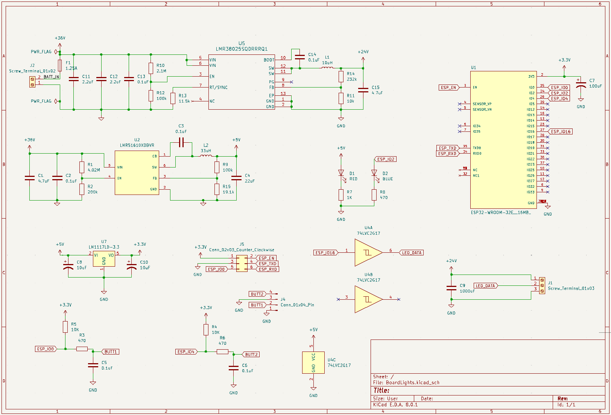
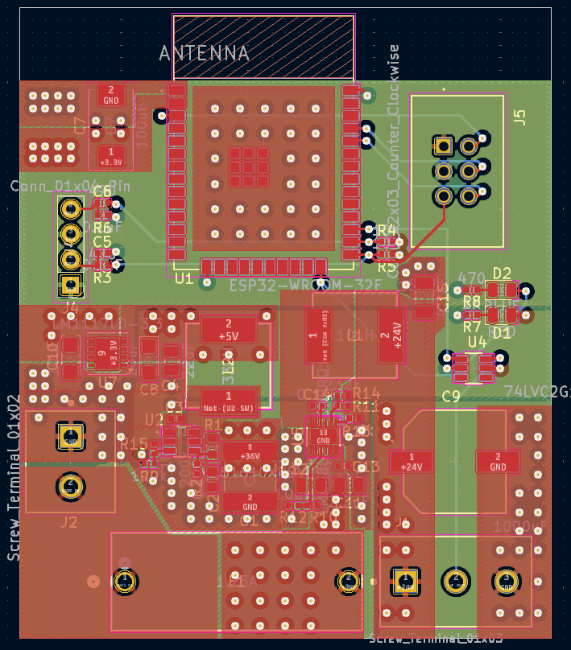
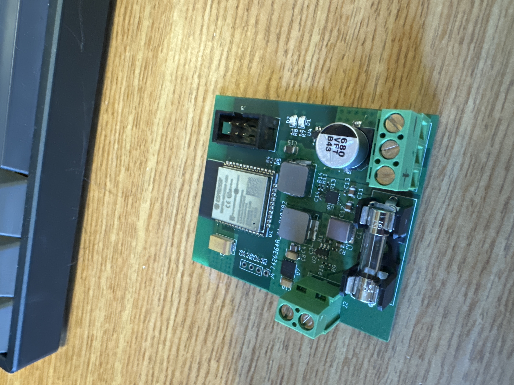

# Meepo V3S ARGB Power & Control PCB
Schematic for Meepo V3S Skateboard Lights. Meant to power [these 24V WS2811 COB Leds](https://www.aliexpress.us/item/3256805848873454.html?gatewayAdapt=glo2usa) using the Meepo V3S 36V Battery and [wled firmware](https://kno.wled.ge/).

https://github.com/user-attachments/assets/10e10ca3-55f4-4bfa-9f18-f33567d93a93

## Known issues
This was my first real PCB project, so there were many (easily fixable) issues, but it still works as-is.
- Did not pull EN high (whoops). Bridge the two upper pins of the connector after the board is powered on.
- ESP-Prog connector is mirrored (whoops again).
- The output capacitor I planned to use did not support 24V. There is a capacitor with the same footprint and lower capacitance but higher max voltage that I used instead. Let me know if you want the full BOM.
- There is no power switch. I intented to use an inline waterproof switch on the connector, but it would have been nice to be able to disable the board without unplugging it or pulling the fuse.
- There are no holes (or space for them) to connect it to a mount.
- Level shifter did not work. I just bridged the pins and it works fine.
